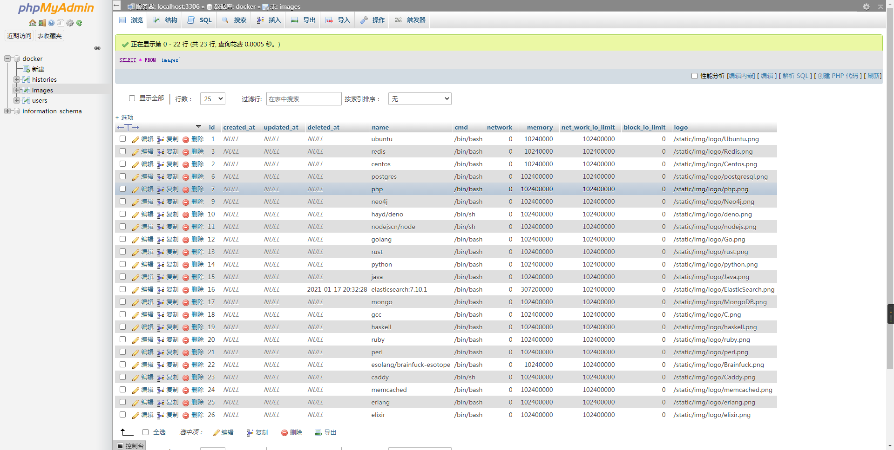
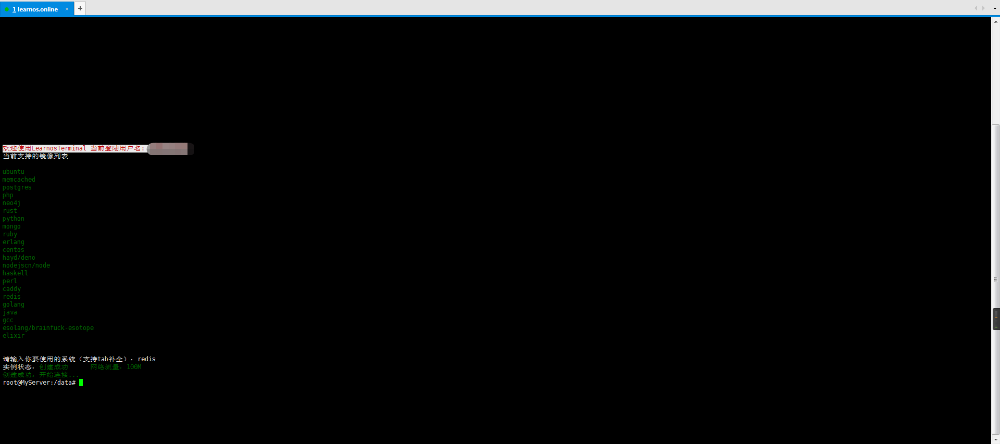

# Learn开源项目简介

[在线体验](https://learnos.online "在线体验")

[部署教程](https://www.bilibili.com/video/BV1MX4y1T72Q/ "部署教程")

<<<<<<< HEAD
- 修复GateWay网关自动选择节点造成的容器节点扩容无效
- 因微服务框架原因，您的所有节点需在同一局域网，否则无法调用（这是我个人开发时候的疏忽，会尽快加入支持分布式部署的更新！）
- Learnos项目是一个使用Go语言开发，基于GoMicro微服务框架的开源项目
=======
- Learnos项目是一个使用Go语言开发，微服务架构的开源项目
>>>>>>> f77170c9b5a4a59acfdfbbd28a0110a6b5d1b25c
- 项目的核心功能为在线创建/使用各种环境，可用于学习/测试（Docker实现）
- 项目使用微服务架构开发，可水平扩展各个节点
- 请勿将本项目用于商业用途，否则所造成的一切损失请自行承担






---
## 该项目主要功能使用以下框架开发
1. gin
2. gorm
3. etcd v3
4. go-micro
5. dockerSDK
---
## 各个节点功能的相关介绍

- ### [WebNode](./Web/WebNode.go "WebNode")
	- 提供用户web面板
	- 提供ssh终端登录服务
	- 提供websocket数据转发
	- 开放用户http接口与GateWayNode进行数据交互
- ### [GateWayNode](./GateWay/GateWayNode.go "GateWayNode")
	- 与数据库进行交互
	- 用户操作相关功能实现
		- 登录、注册、发送验证码、中间件...
	- 容器操作相关功能实现
		- 发送容器创建、获取容器状态、删除等致消息队列中
	- 转发websocket请求、对websocket进行鉴权等相关操作
- ### [ContainerNode](./Container/ContainerNode.go "ContainerNode")
	- 容器相关功能
		- 创建容器
		- 容器资源限制
		- 主动/被动删除容器
---
## 部署相关
- ### 各节点如何部署？
	- #### etcd
	    - 因为减少依赖的想法，所以消息队列和缓存功能皆基于etcd实现
	    - go-micro实现服务注册/发现所用
	    - 部署各节点之前必须先安装启动etcdv3
		- 下载部署etcd v3，并开启用户认证功能，如部署在不同服务器，请确保etcd外网可连接
			- 开启用户认证
			```shell
			etcdctl user add root	#添加root用户,会自动提示设置密码
			etcdctl auth enable 	#开启用户认证功能
			```
			- 监听公网请求
				- 新建etcd.yml，并将如下内容放入该文件 
				- 注意：开头不要有多余空格
				```yml
				name: default
				data-dir: ./default.etcd/
				wal-dir: ./member/wal/
				listen-client-urls: http://0.0.0.0:2379
				advertise-client-urls: http://0.0.0.0:2379
				```
				`etcd --config-file ./etcd.yml		# 运行此命令，使用该配置文件启动etcd`
	- #### 节点编译
		- 首先确保你已安装go语言的编译环境
		```shell
		go build Web/WebNode.go
		go build GateWay/GateWayNode.go
		go build Container/ContainerNode.go
		```
	- #### 节点部署
		- 将修改好的 `config.toml` 与编译后的各节点可执行文件放置于同一目录启动
		- 各节点可部署至单机，亦可以部署至不同服务器
		- 需要注意的是`Container`节点所在机器必须先安装`docker`环境
		- `Web`文件夹以及此文件夹下的`static`和`view`文件夹需要和WebNode在同一目录
		- 因 `kill -9 pid` 命令关闭程序无法被程序捕获，故会导致一些容器和注册信息残留
		建议使用 `kill pid` 进行程序关闭
		- 容器节点在自身可用内容小于100M的时候会停止读取创建队列消息[Container/readQueue/queue.go#L41](Container/readQueue/queue.go#L41 "queue.go")

## 镜像相关
- ### 如何添加镜像至用户可创建的镜像列表？
	- 因时间原因，相关后台并未开发，所以需要对数据库进行操作添加
		- 表：images
			- `name：镜像名	#需要和docker镜像名保持一致`
			- `cmd：docker start时需要执行的命令，一般为/bin/bash，目的在于进入可交互终端`
			- `memory: 内存限制相关，0 -> 不限制，单位：bit`
			- `net_work_io_limit: 流量限制相关，0 -> 不限制，单位：bit`
			- `block_io_limit: blockIo限制相关，0 -> 不限制，单位：次，不建议限制`
			- `logo: 列表显示的logo图片`
	- 如何获取镜像文件名？
	    - https://hub.docker.com/
	    
- ### 注意：因镜像文件大小不一，最好docker pull相关镜像到Container节点所在机器中之后再添加相关镜像文件，Container节点虽然支持创建时节点自动pull相关镜像，但会阻塞后续分配到该节点的创建请求！

---

- 配置文件模板
- [config.toml](./config.toml "config.toml")
```toml
[common]
jwtKey = "ss_jwt_token"          #jwt签发加密秘钥

[webSocket]				    #此配置三个服务需要保护一致
[webSocket.gateWay]		    #gateway节点的websocket服务端口
wsPort  = 8015
[webSocket.container]		#container节点的websocket服务端口
wsPort  = 8015

[etcd]			#etcd版本：v3，此配置三个服务需保持一致，且需要开启用户认证
addr = ["192.168.0.106:2379"]
userName = "root"
passWord = "123456"

[web]			    #只用于web服务
runMode = "release"	#debug test release - [Gin框架RunMode]
webAddr = "127.0.0.1:8011"  #web端口，可反代到80
sshAddr = "127.0.0.1:8022"   #ssh面板功能连接端口，可反代，但必须是tcp反代，不建议

[gateWay]

[gateWay.aliSms]		#此配置只在gateWay中使用
accessId  = "-"
accessKey = "-"
signName  = "-"  #短信签名
template  = "-"  #模板代码

[gateWay.mysql]			#此配置只在gateWay中使用
addr 	 = "127.0.0.1"
port 	 = 3306
userName = "root"
passWord = "root"
dbName   = "gateway_data"
```


---
- 开发者QQ：924417424
- 如有问题可以向我反馈，也可以自行尝试修复
